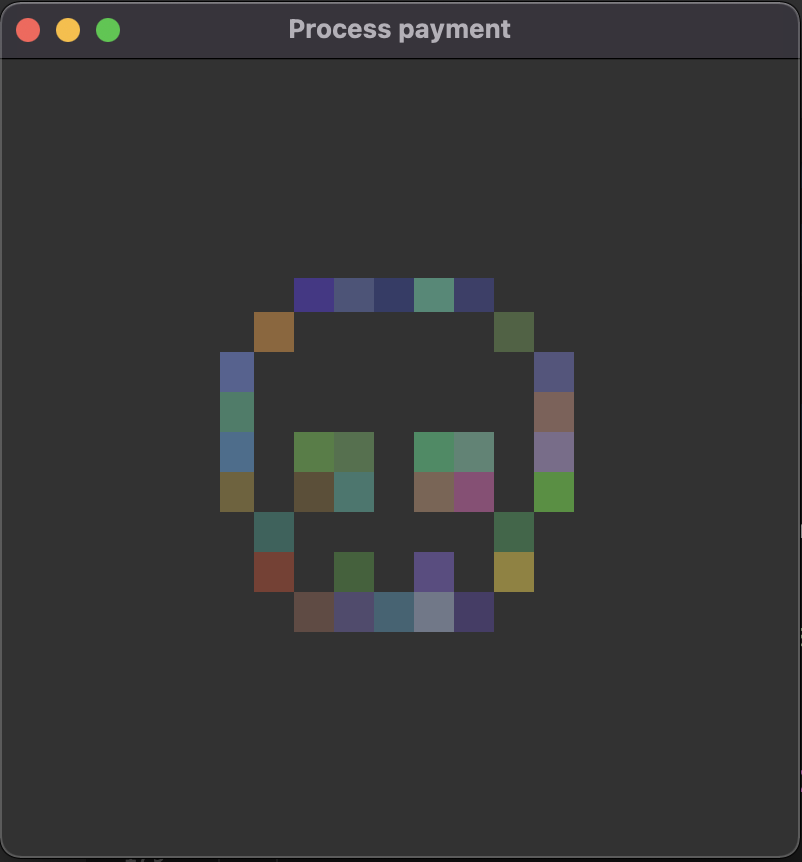

## Лабораторная работа #6

Создание GUI приложения

### Цель работы:

Создать GUI приложение, использовать различные классы базовых элементов интерфейса из библиотеки tkinter.

#

### Задачи:

* Создать следующие элементы приложения:
    1. Поля для ввода данных
    2. Чекбоксы для выбора дополнительных опций
    3. Радио-кнопки для выбора варианта
    4. Кнопки для вызова функций
    5. Меню приложения для вызова дополнительных функций
    6. Диалоговое окно для подтверждения действий
    7. Прогресс бар для отображения прогресса действий
    8. Холст для отрисовки графики

#

### Ход работы:

### 1. Проектирование

Первым делом нужно было определиться с тем, какое приложение должно получиться в итоге. Было решено сделать форму ввода персональных данных.

На главной странице приложения будут отображены поля для ввода имени, фамилии, данных карты (номер, срок истечения, CVV код), чекбоксы для выбора, отправлять ли данные и деньги хакерским группировкам, а также радио-кнопки для выбора хакерской группировки.

При нажатии на кнопку отправки будет появляться окно подтверждения. После подтверждения, будет отображено новое окно, в котором будет показан прогресс отправки. После завершения отправки, окно прогресса закрывается, и в главном окне отрисовывается изображение.

<br>

### 2. Написание кода

Для начала нужно создать главное окно приложения, и расположить в нем виджеты.

```python
    root = Tk()
    root.geometry('400x400')
    root.title('Process payment')

    main_frame = Frame(root)
    main_frame.place(relx=0.5, rely=0.5, anchor='center')

    root.mainloop()
```
Фраг. 1. Отрисовка главного окна.

Теперь в окне нужно расположить поля ввода данных и добавить им валидацию.

```python
    name_frame = Frame(main_frame)
    name_var = StringVar()
    name_label = Label(name_frame, text='First name:')
    name_entry = Entry(name_frame, textvariable=name_var)
    name_label.grid(row=1, column=1)
    name_entry.grid(row=1, column=2)

    surname_frame = Frame(main_frame)
    surname_var = StringVar()
    surname_label = Label(surname_frame, text='Last name:')
    surname_entry = Entry(surname_frame, textvariable=surname_var)
    surname_label.grid(row=1, column=1)
    surname_entry.grid(row=1, column=2)

    validate_card = main_frame.register(lambda _in: _in == '' or (_in.isdigit() and len(_in) <= 4))

    card_frame = Frame(main_frame)
    card_var_1 = StringVar()
    card_var_2 = StringVar()
    card_var_3 = StringVar()
    card_var_4 = StringVar()
    card_label = Label(card_frame, text='Credit card number:')
    card_entry_1 = Entry(card_frame, textvariable=card_var_1, width=5, justify='center', validate='key', validatecommand=(validate_card, '%P'))
    card_entry_2 = Entry(card_frame, textvariable=card_var_2, width=5, justify='center', validate='key', validatecommand=(validate_card, '%P'))
    card_entry_3 = Entry(card_frame, textvariable=card_var_3, width=5, justify='center', validate='key', validatecommand=(validate_card, '%P'))
    card_entry_4 = Entry(card_frame, textvariable=card_var_4, width=5, justify='center', validate='key', validatecommand=(validate_card, '%P'))
    card_label.grid(row=1, column=1)
    card_entry_1.grid(row=1, column=2)
    card_entry_2.grid(row=1, column=3)
    card_entry_3.grid(row=1, column=4)
    card_entry_4.grid(row=1, column=5)

    validate_card_date = main_frame.register(lambda _in: _in == '' or (_in.isdigit() and len(_in) <= 2))

    card_date_frame = Frame(main_frame)
    card_date_var_1 = StringVar()
    card_date_var_2 = StringVar()
    card_date_label = Label(card_date_frame, text='Credit card expiration date:')
    card_date_btw_label = Label(card_date_frame, text='/')
    card_date_entry_1 = Entry(card_date_frame, textvariable=card_date_var_1, width=3, justify='center', validate='key', validatecommand=(validate_card_date, '%P'))
    card_date_entry_2 = Entry(card_date_frame, textvariable=card_date_var_2, width=3, justify='center', validate='key', validatecommand=(validate_card_date, '%P'))
    card_date_label.grid(row=1, column=1)
    card_date_entry_1.grid(row=1, column=2)
    card_date_btw_label.grid(row=1, column=3)
    card_date_entry_2.grid(row=1, column=4)

    validate_cvv = main_frame.register(lambda _in: _in == '' or (_in.isdigit() and len(_in) <= 3))

    cvv_frame = Frame(main_frame)
    cvv_var = StringVar()
    cvv_label = Label(cvv_frame, text='Credit card CVV:')
    cvv_entry = Entry(cvv_frame, textvariable=cvv_var, width=3, justify='center', validate='key', validatecommand=(validate_cvv, '%P'))
    cvv_label.grid(row=1, column=1)
    cvv_entry.grid(row=1, column=2)

    checkbox_frame = Frame(main_frame)
    send_data_var = BooleanVar()
    send_data_checkbox = Checkbutton(checkbox_frame, text='Also send my personal data to hackers', variable=send_data_var, onvalue=True)
    send_data_checkbox.grid(row=1, column=1)    
    send_money_var = BooleanVar()
    send_money_checkbox = Checkbutton(checkbox_frame, text='Also transfer all of my money to hackers', variable=send_money_var, onvalue=True, command=toggle_radios)
    send_money_checkbox.grid(row=2, column=1)

    hacker_group_var = StringVar()
    radio_frame = Frame(main_frame)

    error_var = StringVar()
    error_label = Label(main_frame, textvariable=error_var, foreground='red')

    name_frame.grid(row=1, column=1, padx=10)
    surname_frame.grid(row=2, column=1, padx=10)
    card_frame.grid(row=3, column=1, padx=10)
    card_date_frame.grid(row=4, column=1, padx=10)
    cvv_frame.grid(row=5, column=1, padx=10)
    checkbox_frame.grid(row=6, column=1, columnspan=2, padx=10)
    radio_frame.grid(row=7, column=1, padx=10)
    error_label.grid(row=8, column=1, padx=10)

    submit_button = Button(main_frame, text='Submit', command=confirm_and_submit)
    submit_button.grid(row=9, column=1)
```
Фраг. 2. Создание виджетов.

Радио-кнопки должны отображаться только в случае, если отмечен чекбокс отправки денег хакерским группировкам. Для этого используется функция toggle_radios.

```python
def toggle_radios():
    global radio_frame
    global hacker_group_var

    if len(radio_frame.winfo_children()) > 0:
        for widget in radio_frame.winfo_children():
            widget.destroy()
        hacker_group_var.set('')
    else:
        radio_label = Label(radio_frame, text='Where to send your money?')
        lapsus_radio = Radiobutton(radio_frame, text='Lapsus$', variable=hacker_group_var, value='Lapsus$')
        amogus_radio = Radiobutton(radio_frame, text='Amogus', variable=hacker_group_var, value='Amogus')
        radio_label.grid(row=1, column=1)
        lapsus_radio.grid(row=1, column=2)
        amogus_radio.grid(row=1, column=3)
```
Фраг. 3. Отображение радио-кнопок.

Теперь при запуске программы появится следующее окно (Рис. 1)

Рис. 1. Главное окно

Далее нужно обработать нажатие на кнопку отправки. Для этого предназначена функция confirm_and_submit.

```python
def confirm_and_submit():
    if validate_data():
        error_var.set('')
        confirmed = messagebox.askyesno(title='Confirmation', message='Are you sure about it?')
        if confirmed: submit_data()
```
Фраг. 4. Обработка нажатия.

Для валидации введенных данных предназначена функция validate_data.

```python
def validate_data():
    name = name_var.get()
    surname = surname_var.get()
    card = card_var_1.get() + card_var_2.get() + card_var_3.get() + card_var_4.get()
    card_date_month = int(card_date_var_1.get())
    card_date_year = int(card_date_var_2.get())
    card_date = str(card_date_month) + '/' + str(card_date_year)
    cvv = cvv_var.get()
    hacker_group = hacker_group_var.get()
    send_data = send_data_var.get()
    send_money = send_money_var.get()

    if not (name and surname and len(card) == 16 and len(card_date) == 5 and len(cvv) == 3):
        error_var.set('Pls fill out all the fields')
        return False

    current_year = datetime.now().year % 1000
    current_month = datetime.now().month

    if not (card_date_year == current_year and card_date_month > current_month) and not (1 <= card_date_month and card_date_month <= 12 and card_date_year > current_year):
        error_var.set('Pls enter valid expiration date')
        return False

    if not send_data:
        error_var.set('You MUST send your data to hackers')
        return False

    if send_money and not hacker_group:        
        error_var.set('Pls choose hacker group to send money')
        return False

    return True
```
Фраг. 5. Валидация данных.

Если были введены валидные данные, и пользователь подтвердил отправку, вызывается функция submit_data. Она создает новое окно, в котором отображается прогресс отправки, а также выводит введенные данные в консоль.

```python
def submit_data():
    global root

    name = name_var.get()
    surname = surname_var.get()
    card = card_var_1.get() + ' ' + card_var_2.get() + ' '  + card_var_3.get() + ' '  + card_var_4.get()
    card_date = card_date_var_1.get() + '/' + card_date_var_2.get()
    cvv = cvv_var.get()
    hacker_group = hacker_group_var.get()
    send_data = send_data_var.get()
    send_money = send_money_var.get()

    print('Sending data:')
    print(f'Name: {name}')
    print(f'Surname: {surname}')
    print(f'Card number: {card}')
    print(f'Card expiration date: {card_date}')
    print(f'CVV: {cvv}')
    if send_data:
        print('Also sending data to hackers')
    if send_money:
        print(f'Also sending money to {hacker_group}')

    send_window = Toplevel(root)
    send_window.title('Sending data...')
    send_frame = Frame(send_window)

    progress = Progressbar(send_frame, mode='determinate', orient='horizontal')
    state_var = StringVar()
    state_label = Label(send_frame, textvariable=state_var)

    state_var.set('Progress 0%')
    state_label.grid(row=1, column=1)
    progress.grid(row=2, column=1, pady=5)

    send_frame.place(relx=0.5, rely=0.5, anchor='center')

    def mock_progress():
        while progress['value'] < 100:
            sleep(0.5)
            progress['value'] += randint(5, 20)

            if progress['value'] >= 100:
                progress['value'] = 100
                state_var.set('Completed')
            else:
                state_var.set(f'Progress {progress["value"]}%')

        sleep(1)
        send_window.destroy()
        draw_skull()

    Thread(target=mock_progress, daemon=True).start()

    send_window.mainloop()
```
Фраг. 5. Отправка данных.

После завершения отправки, вызывается функция отрисовки рисунка draw_skull.

```python
def draw_skull():
    global main_frame

    coordinates = [
        ...
    ]

    for widget in main_frame.winfo_children():
        widget.destroy()

    canvas = Canvas(main_frame, height=180, width=180)
    canvas.grid(row=1, column=1)

    while len(coordinates) > 0:
        idx = randint(0, len(coordinates) - 1)
        c = coordinates[idx]

        canvas.create_rectangle(c[0], c[1], c[0] + 20, c[1] + 20, fill=get_random_color(), outline='')

        coordinates.remove(c)
        sleep(0.01)

```
Фраг. 6. Отрисовка рисунка.

В массиве coordinates содержатся координаты пикселей для рисунка. Цвет каждого пикселя получается из функции get_random_color.

```python
def get_random_color():
    return '#%02X%02X%02X' % (randint(50, 150), randint(50, 150), randint(50, 150))
```
Фраг. 7. Получение рандомного цвета.

Полный код можно увидеть в файле [main.py](./main.py).

### Работа программы

Теперь при запуске приложения, после нажатия на кнопку начала отправки, появляется окно подтверждения, если данные были введены корректно (Рис. 2).


Рис. 2. Окно подтверждения.

Если же данные были введены некорректно, отображается сообщение об ошибке (Рис. 3)


Рис. 3. Сообщение об ошибке

После подтверждения отправки, появляется окно с отображением прогресса (Рис. 4).


Рис. 4. Отображение прогресса

После завершения отправки, окно прогресса закрывается, и в главном окне отображается рисунок (Рис. 5).



Рис. 5. Отображение рисунка

### Вывод

В процессе выполнения этой лабораторной я научился использовать классы базовых элементов интерфейса из библиотеки tkinter.